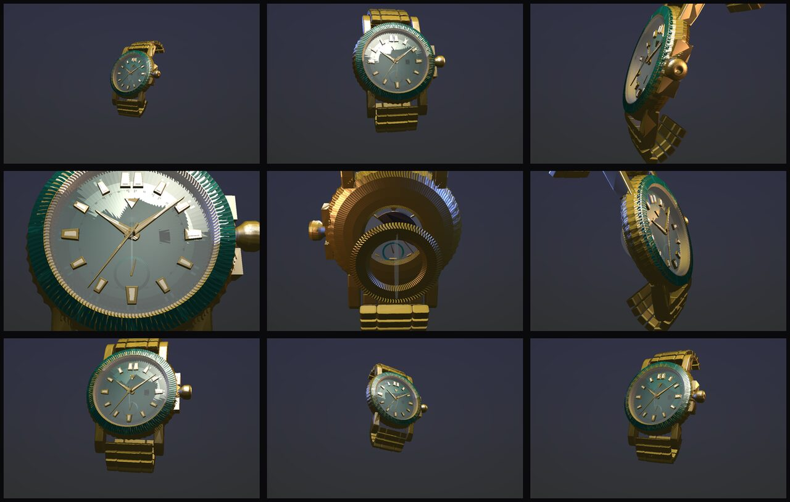

# AURELIS · Laureate No. 01 — an interactive exhibition

A scroll-driven **WebGL exhibition**, not a product page: one persistent canvas,
nine chapters, and a camera that travels through the timepiece — case, dial,
calibre, the hands that finish it — under the visitor's scrollbar. React Three
Fiber, `@react-three/drei`, TypeScript and Vite, engineered to hold 60 FPS on a
phone.

[](https://github.com/Haseebriasat7767/Watch-websites/actions/workflows/ci.yml)



*The nine chapter framings, rendered without a browser by
`npm run storyboard` — see [Verification](#verification).*

---

## Quick start

```bash
npm install
npm run dev        # http://localhost:5173
npm run build      # typecheck + production bundle
npm run check      # typecheck + the full 3D verification suite
npm run storyboard # headless render of every chapter's composition
```

---

## The journey

Scrolling is the only navigation. Page progress is normalised once per frame and
mapped to chapter progress, which drives the camera waypoint, the watch
transform, the light rig, the atmosphere and the narrative opacity — in that
order, from a single rAF tick.

| # | Chapter | What the camera does | What is revealed |
| --- | --- | --- | --- |
| 01 | Enter the Atelier | wide, almost black, a slow drift | the timepiece emerging from the dark |
| 02 | The Silhouette | closes in, turntable running | proportion, the whole object |
| 03 | The Case | rakes along the flank | lugs, coin edge, crown, finishing |
| 04 | The Dial | pushes through the sapphire | indices, hands, the sunburst field |
| 05 | The Calibre | travels *through* the watch to behind it | the case back withdraws, calibre A01 runs |
| 06 | Human Hands | raking macro + a blended atelier image | bevels, polish, the bench |
| 07 | Materials | pulls back to the full object | the contextual material selector appears |
| 08 | On the Wrist | drops back and to the side | scale, daily life |
| 09 | Laureate No. 01 | a calm hero composition, light lifts | the closing statement and the CTA |

The camera holds on each waypoint for the first third of a chapter — the beat
during which its narrative is legible — then eases to the next. Nothing cuts.

**Chapter 05 is a real mechanism.** The exhibition back slides away and a
parametric automatic calibre is exposed: a perlaged main plate, Côtes-de-Genève
bridges, a going train that turns, a balance beating at 4 Hz and 31 synthetic
rubies (`src/three/Calibre.tsx`, ~12 draw calls, geometry built once).

**Configuration is contextual, not a dashboard.** The material selector floats
in during chapter 07 and is otherwise reachable only through the discreet
*Configure* control. There is no permanent sidebar anywhere in the experience.

---

## The scroll engine

```
scroll progress            one passive listener, one rAF loop
      ↓
chapter progress           locate() → { chapter, local }
      ↓
camera waypoint interpolation + screen-space framing bias
      ↓
watch position / rotation / scale / exhibition
      ↓
lighting, atmosphere, and the HTML narrative — same tick
```

Three rules keep it fast:

1. **Scroll never touches React state.** The `story` bus (`storyState.ts`) is a
   mutable object; only a *chapter change* is published to React, through
   `useSyncExternalStore`. The 3D tree renders once for the whole visit.
2. **One sample per frame.** `sampleStory()` writes into a single pre-allocated
   record (`activeSample`); the camera rig, the lights, the dust and the calibre
   all read from it. No allocation in the loop.
3. **DOM mutations ride the same tick.** Narrative panels, the progress rail and
   the atmosphere layers subscribe to `subscribeFrame` and write their own
   `style` properties, so HTML and WebGL are frame-locked.

**Framing bias.** Each chapter declares where the timepiece should sit in the
frame (`bias`, in fractions of the half viewport, plus a portrait override). The
rig *trucks* the camera rather than moving the subject, so the modelling of the
light is untouched while the watch stays clear of the narrative column — and on
a phone the composition lifts above the bottom-anchored text automatically.

---

## Architecture

```
src/
├─ main.tsx                   ← mounts the exhibition
├─ index.css / atelier.css    ← design tokens + the exhibition stylesheet
├─ story/
│  ├─ ImmersiveStory.tsx      ← root: scroll engine, canvas, narrative, chrome
│  ├─ StoryCanvas.tsx         ← persistent <Canvas>, drag orbit, adaptive DPR, GL boundary
│  ├─ StorySections.tsx       ← nine semantic <section>s, frame-locked fades
│  ├─ StoryOverlay.tsx        ← wordmark, counter, controls, material selector
│  ├─ StoryProgress.tsx       ← hairline rail + keyboard chapter marks
│  ├─ StoryFallback.tsx       ← the written exhibition (no WebGL required)
│  ├─ storyConfig.ts          ← THE SCRIPT: nine chapters as data
│  ├─ storyTypes.ts           ← chapter / waypoint types
│  ├─ storyState.ts           ← the scroll bus + coarse React subscriptions
│  ├─ useStoryProgress.ts     ← one listener, one rAF loop
│  ├─ useReducedMotion.ts     ← OS preference + in-page override
│  └─ useAtelierAudio.ts      ← synthesised room tone (no audio download)
├─ three/
│  ├─ CameraWaypoints.ts      ← interpolation, framing bias, the shared sample
│  ├─ StoryWatchStage.tsx     ← the rig: camera, watch transform, sub-assemblies
│  ├─ StoryLighting.tsx       ← baked gallery IBL + scroll-driven light rig
│  ├─ Calibre.tsx             ← the running calibre A01
│  ├─ Atmosphere.tsx          ← 800 motes of dust in one additive draw call
│  ├─ ProceduralWatch.tsx     ← the atelier timepiece (unchanged geometry, new part refs)
│  ├─ geometry.ts             ← lathe/revolve solids, hands, indices, bracelet
│  ├─ materials.tsx           ← material set + MaterialDriver
│  └─ Studio.tsx              ← the original studio rig (still used by the legacy view)
└─ lib/
   ├─ config.ts               ← material presets, sub-mesh targeting, scene constants
   ├─ dialTexture.ts          ← canvas atelier: sunburst, fumé, guilloché
   ├─ color.ts                ← swatch + texture colour maths
   └─ telemetry.ts            ← external FPS/DPR store

scripts/
├─ verify.ts                  ← 112 headless geometry/texture/targeting assertions
├─ render.ts                  ← software rasterizer (now camera/pose parameterised)
└─ storyboard.ts              ← renders every chapter's composition, headlessly
```

Adding a chapter is a data edit: append an entry to `storyConfig.ts` with its
copy, camera waypoint, watch transform and lighting mood. Nothing in the render
loop is chapter-aware.

---

## Deploy on Vercel

The repository is already configured for it — `vercel.json` pins the framework,
the build command, the output directory and the response headers, and
`package.json` pins the Node runtime (vite 8 requires `^20.19 || >=22.12`, so
`"engines": { "node": "22.x" }` stops Vercel from picking a runtime the
toolchain cannot use).

> **Which branch?** The exhibition lives on `arena/01a0dc8b-watch-websites`.
> Either merge it into `main` before importing the project, or set the
> **Production Branch** to that branch in the Vercel dashboard.

**Option A · Git integration (recommended — deploys on every push)**

1. Merge the exhibition branch into `main`.
2. Go to [vercel.com/new](https://vercel.com/new) and import
   `Haseebriasat7767/Watch-websites`. Vercel reads `vercel.json`, so there is
   nothing to configure.
3. Every push to `main` ships to production; every other branch and PR gets its
   own preview URL.

[](https://vercel.com/new/clone?repository-url=https%3A%2F%2Fgithub.com%2FHaseebriasat7767%2FWatch-websites&project-name=aurelis-watch-atelier&repository-name=aurelis-watch-atelier)

**Option B · CLI**

```bash
npm run deploy            # vercel --prod
npm run deploy:preview    # a throwaway preview URL
```

**What the deploy actually runs**

| Setting | Value | Why |
| --- | --- | --- |
| `framework` | `vite` | static output, global edge CDN |
| `installCommand` | `npm ci` | reproducible installs from the lockfile |
| `buildCommand` | `npm run verify && npm run build` | the 112 geometry assertions gate the deploy — broken 3D never ships |
| `outputDirectory` | `dist` | |

Plus: `immutable` caching on `/assets/*` and `/draco/*` (every asset is
content-hashed), `must-revalidate` on `index.html`, an SPA rewrite so deep links
resolve, and `nosniff` / `Referrer-Policy` / HSTS / `Permissions-Policy` on
everything. `.github/workflows/ci.yml` runs the same checks on every push, so a
red build blocks the deploy at the source.

---

## The timepiece

A 40 mm automatic built entirely from parametric geometry — **22k triangles of
case, 50k including the bracelet, in ~20 draw calls**:

- fluted coin-edge bezel with a printed 0–60 scale and a luminous pip at twelve
- box-domed sapphire crystal, double AR, seated over a conical rehaut
- applied indices — polished frames with recessed luminous inlays
- sword hands, a 72-hour power-reserve subdial, a screw-down crown between guards
- five-link tapering bracelet laid on a wrist curve, in two instanced draws
- an exhibition case back that opens in chapter 05 onto the running calibre

Three case materials and three dial finishes are driven live: a click eases the
*existing* material's physical vector (`color` / `roughness` / `metalness`)
toward the preset over ~140 ms from inside the render loop. Nothing is swapped,
remounted or re-uploaded, and the scene is never rebuilt.

| Channel | Options |
| --- | --- |
| **Case** | Polished Gold `#D4AF37` · Platinum Silver `#E5E4E2` · Stealth Matte Black `#1A1A1A` |
| **Dial** | Emerald Sunburst `#097969` · Midnight Horizon `#191970` · Crimson Guilloché `#8B0000` |


---

## Performance engineering

| Technique                              | What it buys                                                                 |
| -------------------------------------- | ---------------------------------------------------------------------------- |
| Zero React renders while scrolling     | the scroll bus is a mutable object; only a chapter change reaches React        |
| One allocation-free sample per frame   | camera, lights, dust and calibre all read the same pre-computed record         |
| 2 instanced draws for all 32 links     | 28k bracelet triangles cost two draw calls                                    |
| Materials shared, geometry memoised    | a click mutates five materials; no allocation, no remount, no GPU upload       |
| Three dial finishes prepared at boot   | switching a variant is a `Texture` pointer swap — zero dropped frames          |
| `<Preload all />`                      | every shader program compiles before the first interaction                     |
| Rolling-window FPS governor            | nudges the render scale between 1.0×/1.35×/device DPR to stay inside the thermal envelope |
| `dpr={[1, 1.85]}` + `AdaptiveDpr`      | prevents 3× device-pixel-ratio phones from rendering 9× the pixels             |
| Analytic lighting budget               | 5 lights, one shadow caster, no post-processing pass                           |
| Baked Lightformer IBL (`frames={1}`)   | the gallery environment is rendered once at 256² — and never fetched from a CDN |
| CSS focus-pull instead of a DoF pass   | the frame softens while the camera travels for the cost of one composited blur |
| Procedural, zero-network asset         | the whole timepiece costs 0 bytes of model bandwidth and 22k triangular budget |

The dust field, the calibre and the turntable all stop dead under
`prefers-reduced-motion`.

---

## Loading the production GLB

The component ships with a **verified, deterministic asset of its own** — the
parametric timepiece above — because the asset link supplied in the brief
(`https://github.com` / `https://githubusercontent.com`) is a documentation
placeholder, not a real model, and no third-party watch GLB could be verified as
openly licensed, hotlink-safe and compositionally reliable.

Everything needed for the hosted-GLB lane is already wired. To use a real model:

```bash
# 1 · drop the Draco decoder runtime into public/draco/  (see public/draco/README.md)
# 2 · point the component at your asset
```

```ts
// src/lib/config.ts
export const MODEL_URL =
  'https://raw.githubusercontent.com/<owner>/<repo>/<ref>/public/watch-draco.glb'
```

That is the entire change. The stage then loads the asset through
`useGLTF(url, '/draco/')` — **Draco is forced natively** by the decoder path —
inside the same `<Suspense>` boundary and behind the same loading overlay, with
`<Preload all />` compiling its programs and `<BakeShadows />` still baking the
stage. The GLB lane is code-split: while the procedural asset is in use, the
glTF loader is never even downloaded.

**Sub-mesh targeting.** On load, the scene graph is traversed once: each node's
name (and its material + parent names) is matched against the presets' exact
`targets`, falling back to their fuzzy `keywords` for third-party naming
conventions such as `Watch_Case.001`. Every match receives a **cloned** material
— overrides never leak into instances shared with other parts of the model — and
the clones are registered with the same `MaterialDriver`, so the state coupling
is identical for imported and procedural geometry.

---

## Verification

There is no browser in CI, so the 3D pipeline is asserted numerically instead —
`npm run verify` runs **112 checks**: every solid is checked for NaN-free
attributes, outward winding, and edge-manifold consistency; the assembly is
checked for the crystal clearing the hand stack at every sweep angle, the bracelet
clearing the stage, and the case fitting the locked frustum; the canvas textures
are checked to print their scales and marks; and the GLTF resolver is exercised
against a synthetic imported scene graph.

`npm run storyboard` answers the question a screenshot would, without a browser:
for each chapter the story sampler is evaluated at its readable beat, and the
resulting camera pose, framing bias and watch transform are fed to the software
rasterizer. It is how the composition of all nine chapters above was verified —
is the timepiece in frame, at the intended scale, from the intended angle, and
does the camera ever end up inside the case.

`npm run render` runs the same **software rasterizer** over the exact same geometry
graph and writes `preview/desktop.ppm` + `preview/mobile.ppm` — the stills at the
top of this document. It is a stylised studio model rather than a PBR match, and
exists to catch composition and mapping regressions without a GPU.

`npm run render:textures` goes further: `scripts/canvas2d.ts` is a small,
dependency-free Canvas 2D implementation (paths, arcs, gradients, even-odd and
non-zero clipping, supersampled scanline fill, blend modes) that lets the **real
texture atelier** run in Node. It asserts that each plate is painted, that the
minute track and printed bezel scale land at the right radii, that the date
aperture is cut at three, and that the house marks composite onto the dial —
then writes `preview/dial-*.ppm` for inspection.

```bash
npm run check          # typecheck + 112 geometry/texture/targeting assertions
npm run render        # regenerate every reference still
DEBUG_BACKFACES=1 npm run render   # highlight any inside-out face in magenta
```

---

## Accessibility & resilience

The experience does not depend on WebGL.

- **The story is real HTML.** Nine semantic `<section>`s with real headings and
  prose sit above the canvas; scroll only changes their opacity, so the whole
  narrative is available to a screen reader, to search engines and with styles
  off. The canvas itself is `aria-hidden` and purely presentational.
- **A written exhibition** replaces the scene when WebGL is unavailable or the
  context is lost mid-visit — same chapters, same words, with photography.
- **Reduced motion** is honoured from the OS *and* toggleable in-page
  (*Motion on/off*): the turntable, parallax, dust drift, focus pull and long
  camera travels stop; the chapters still change, faster and simpler.
- **Keyboard**: a skip link, focus-visible rings on every control, and chapter
  marks on the progress rail that are real buttons with `aria-label`s.
- **Audio never autoplays.** It starts off; the graph is only built on the click
  that enables it, and it is synthesised — no audio file is downloaded.
- The chapter counter is a polite live region; the material selector is `inert`
  while hidden, so it cannot be tabbed into behind the story.
- `touch-action: pan-y` on the canvas: a phone scrolls the story and turns the
  watch with the same finger.

---

## Browser support

Chrome/Edge 111+, Safari 16.4+, Firefox 121+ — anything with WebGL2 and
`OffscreenCanvas` (the texture pipeline falls back to `HTMLCanvasElement` where
`OffscreenCanvas` is missing).

## Hosting notes

The build is fully static — one HTML file, content-hashed JS/CSS, and the Draco
decoder under `/draco/` if you later point `MODEL_URL` at a compressed GLB. There
is no server, no environment variable and no runtime secret, so any static host
works (Vercel, Netlify, Cloudflare Pages, GitHub Pages with a `base` tweak). On
Vercel, `npm run build` is the whole story.

---

## Notes on the references

The interaction *architecture* — a persistent canvas, a guided scroll journey
through a subject, held beats between camera waypoints, narrative that changes
with the scene — is the lesson taken from long-form WebGL exhibitions such as
the Getty's Persepolis experience. Nothing else is: no branding, artwork, copy,
layout or asset is derived from any third party. The visual language here is
its own — obsidian, champagne gold and ivory, hairline rules, a serif at wide
measure over monospaced technical labels — and every pixel of the timepiece is
generated at runtime from the parametric geometry in this repository.
