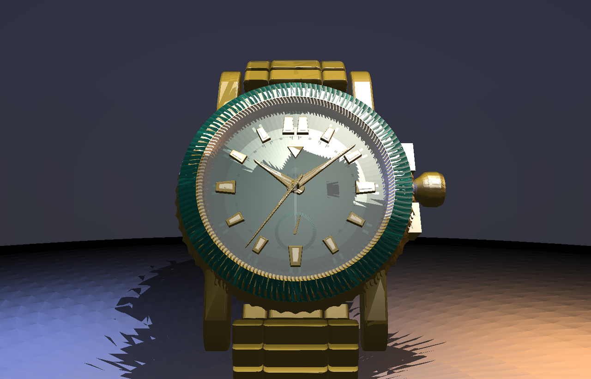
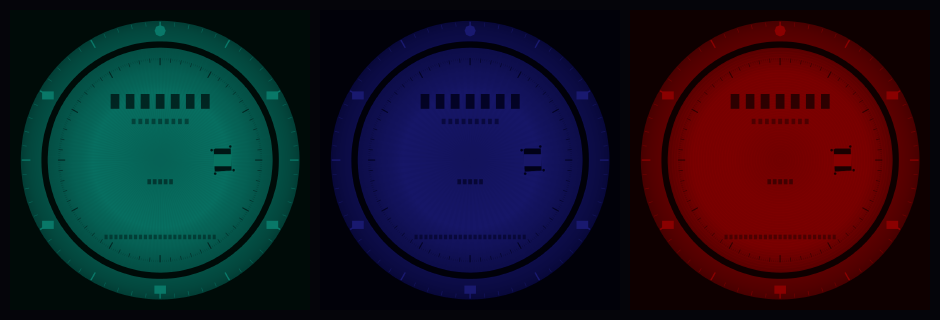
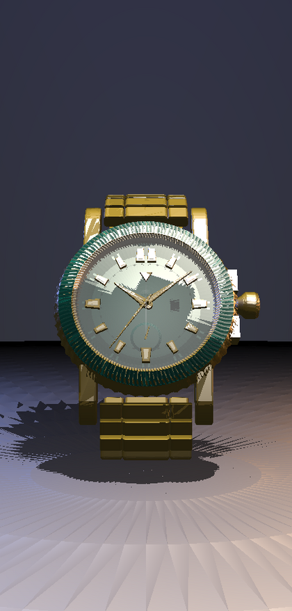

# AURELIS · Bespoke Timepiece Atelier

An ultra-premium, single-page **3D luxury watch customizer** — React Three Fiber,
`@react-three/drei` and Tailwind CSS v4, dark-themed, mobile-first and engineered
to hold a locked 60 FPS on iOS and Android without thermal throttling.



---

## Quick start

```bash
npm install
npm run dev        # http://localhost:5173
npm run build      # typecheck + production bundle
npm run check      # typecheck + the full 3D verification suite
```

---

## What you get

**A configurator that is actually coupled to the mesh.** Every material option
carries a physical vector — `color`, `roughness`, `metalness` — and a click eases
the *live* material towards it over ~140 ms, frame-rate-independently, from inside
the render loop. Nothing is swapped, remounted or re-uploaded; it reads as a
jeweller rotating a part under the light.

| Channel                    | Options                                                                        |
| -------------------------- | ------------------------------------------------------------------------------ |
| **I · Casing Materials**   | Polished Gold `#D4AF37` · Platinum Silver `#E5E4E2` · Stealth Matte Black `#1A1A1A` |
| **II · Bezel & Dial Face** | Emerald Sunburst `#097969` · Midnight Horizon `#191970` · Crimson Guilloché `#8B0000` |

The dial's finish changes with the variant: radial sunburst brushing, a fumé
lacquer gradient, or a rose-engine guilloché turning — generated at load time on
a canvas, so switching is a pointer move with zero GPU uploads.



*Albedo = preset colour × finish map, composited in linear space exactly as the
shader does — the check that each configured hue survives its texture. The
finish maps are deliberately neutral in hue and stay luminous, because `map` is
multiplied into `material.color`: baked-in colour would make the configurator's
physical vector a no-op, and a dark map would drag Emerald, Midnight and Crimson
down with it.*

---

## The timepiece

A 40.5 mm automatic in polished metal, built entirely from parametric geometry —
**22k triangles of case, and 50k including the bracelet, in ~20 draw calls**:

- fluted coin-edge bezel with a printed 0–60 dive scale and a luminous pip at twelve
- box-domed sapphire crystal, double AR, seated over a conical rehaut
- applied indices — polished metal frames with recessed luminous inlays, the
  twelve doubled in the classic style
- sword hands frozen at 10:09:36, plus a 72-hour power-reserve subdial
- screw-down crown between guards, lugs integral to a fluted case band
- five-link bracelet, tapering 10 % toward the clasp, laid on a wrist curve
- exhibition case back with a skeleton rotor



---

## Architecture

```
src/
├─ WatchCustomizer.tsx        ← the single-page component: overlays + the studio
├─ App.tsx                    ← mounts it
├─ index.css                  ← design tokens (@theme), glass/gold/hairline utilities
├─ lib/
│  ├─ config.ts               ← material presets, sub-mesh targeting, specs, camera matrix
│  ├─ dialTexture.ts          ← canvas atelier: sunburst, fumé, guilloché, dive scale
│  ├─ color.ts                ← swatch + texture colour maths
│  └─ telemetry.ts            ← external FPS/DPR store (readout renders in isolation)
└─ three/
   ├─ Studio.tsx              ← studio lighting engine, stage floor, shadow bake
   ├─ ProceduralWatch.tsx     ← the atelier timepiece assembly
   ├─ GLTFWatch.tsx           ← the production GLB lane (Draco forced)
   ├─ geometry.ts             ← lathe/revolve solids, hands, indices, bracelet
   ├─ materials.tsx           ← material set, GLTF sub-mesh resolver, MaterialDriver
   └─ useStageScale.ts        ← hero framing + the stage-to-floor relationship

scripts/
├─ verify.ts                  ← 112 headless geometry/texture/targeting assertions
└─ render.ts                  ← software rasterizer → preview stills (no browser)
```

### Layout

A floating glass sidebar (`absolute left-6 top-6 bottom-6 w-80 backdrop-blur-md`,
`rounded-2xl`, `z-10`) carries the two configurator groups, an allocation plate and
the **Reserve Custom Timepiece** call to action. A monospaced technical dossier
sits opposite it — *Movement: Caliber R3F-Automatic · Power Reserve: 72 Hours ·
Depth Rating: 100m* — followed by the live configuration readout and the frame
telemetry. Below `lg`, the sidebar becomes a bottom configurator sheet and the
dossier a compact spec strip, so the studio stays centre stage on a phone.

---

## Studio lighting engine

No default ambient/directional pair. A real three-point studio array:

```tsx
<Environment preset="studio" environmentIntensity={1.5} />   // the softbox wall
<ambientLight intensity={0.3} />                             // base fill, locked
<spotLight position={[0.9, 3.5, 2.4]} castShadow … />        // key + micro-shadow
```

plus two rim kickers (cool left, warm right) that graze the coin edge, and a
soft top fill. The key is the *only* shadow caster: it plants the micro-shadow
directly beneath the casing. If the HDR preset cannot be fetched, an error
boundary swaps in an equivalent `Lightformer` softbox rig, so the studio lights
up on an isolated network too.

**Camera matrix:** `position [0, 0, 3.5]`, FOV `45`. Orbit is constrained to
`minDistance 2 · maxDistance 5.5 · enablePan={false}`, with the polar angle
clamped to `Math.PI / 3 … Math.PI / 1.8` — the camera can never clip underneath
the studio floor.

---

## Performance engineering

| Technique                              | What it buys                                                                 |
| -------------------------------------- | ---------------------------------------------------------------------------- |
| `<BakeShadows />`                      | the stage is static, so the shadow map is rendered **once**, not per frame     |
| 2 instanced draws for all 32 links     | 28k bracelet triangles cost two draw calls                                    |
| Materials shared, geometry memoised    | a click mutates five materials; no allocation, no remount, no GPU upload       |
| Three dial finishes prepared at boot   | switching a variant is a `Texture` pointer swap — zero dropped frames          |
| `<Preload all />`                      | every shader program compiles before the first interaction                     |
| Rolling-window FPS governor            | nudges the render scale between 1.0×/1.35×/device DPR to stay inside the thermal envelope |
| `dpr={[1, 1.85]}` + `AdaptiveDpr`      | prevents 3× device-pixel-ratio phones from rendering 9× the pixels             |
| Analytic lighting budget               | 4 lights, all low-cost; no post-processing pass                                |
| Procedural, zero-network asset         | the whole timepiece costs 0 bytes of model bandwidth and 22k triangular budget |

The readout in the HUD is live: it reports the measured FPS and the render scale
the governor has settled on.

---

## Loading the production GLB

The component ships with a **verified, deterministic asset of its own** — the
parametric timepiece above — because the asset link supplied in the brief
(`https://github.com` / `https://githubusercontent.com`) is a documentation
placeholder, not a real model, and no third-party watch GLB could be verified as
openly licensed, hotlink-safe and compositionally reliable.

Everything needed for the hosted-GLB lane is already wired. To use a real model:

```bash
# 1 · drop the Draco decoder runtime into public/draco/  (see public/draco/README.md)
# 2 · point the component at your asset
```

```ts
// src/lib/config.ts
export const MODEL_URL =
  'https://raw.githubusercontent.com/<owner>/<repo>/<ref>/public/watch-draco.glb'
```

That is the entire change. The stage then loads the asset through
`useGLTF(url, '/draco/')` — **Draco is forced natively** by the decoder path —
inside the same `<Suspense>` boundary and behind the same loading overlay, with
`<Preload all />` compiling its programs and `<BakeShadows />` still baking the
stage. The GLB lane is code-split: while the procedural asset is in use, the
glTF loader is never even downloaded.

**Sub-mesh targeting.** On load, the scene graph is traversed once: each node's
name (and its material + parent names) is matched against the presets' exact
`targets`, falling back to their fuzzy `keywords` for third-party naming
conventions such as `Watch_Case.001`. Every match receives a **cloned** material
— overrides never leak into instances shared with other parts of the model — and
the clones are registered with the same `MaterialDriver`, so the state coupling
is identical for imported and procedural geometry.

---

## Verification

There is no browser in CI, so the 3D pipeline is asserted numerically instead —
`npm run verify` runs **112 checks**: every solid is checked for NaN-free
attributes, outward winding, and edge-manifold consistency; the assembly is
checked for the crystal clearing the hand stack at every sweep angle, the bracelet
clearing the stage, and the case fitting the locked frustum; the canvas textures
are checked to print their scales and marks; and the GLTF resolver is exercised
against a synthetic imported scene graph.

`npm run render` runs a **software rasterizer** over the exact same geometry
graph and writes `preview/desktop.ppm` + `preview/mobile.ppm` — the stills at the
top of this document. It is a stylised studio model rather than a PBR match, and
exists to catch composition and mapping regressions without a GPU.

`npm run render:textures` goes further: `scripts/canvas2d.ts` is a small,
dependency-free Canvas 2D implementation (paths, arcs, gradients, even-odd and
non-zero clipping, supersampled scanline fill, blend modes) that lets the **real
texture atelier** run in Node. It asserts that each plate is painted, that the
minute track and printed bezel scale land at the right radii, that the date
aperture is cut at three, and that the house marks composite onto the dial —
then writes `preview/dial-*.ppm` for inspection.

```bash
npm run check          # typecheck + 112 geometry/texture/targeting assertions
npm run render        # regenerate every reference still
DEBUG_BACKFACES=1 npm run render   # highlight any inside-out face in magenta
```

---

## Accessibility & resilience

- Material options are real `<button>`s with `aria-pressed`; the CTA is keyboard
  reachable with a visible focus ring.
- The loading overlay is a polite live region and announces *Optimizing 3D Mesh
  Assets…*; an 8-second failsafe releases it if a scene never reports ready.
- A WebGL failure renders a composed message instead of a blank page.
- `prefers-reduced-motion` stops the turntable and collapses every transition.
- Losing the 2D canvas (texture generation) degrades to exact preset colours
  rather than throwing.
- `touch-action: none` on the canvas so orbits never scroll the page, and
  one-finger rotate / two-finger dolly-rotate gestures mapped explicitly.

---

## Browser support

Chrome/Edge 111+, Safari 16.4+, Firefox 121+ — anything with WebGL2 and
`OffscreenCanvas` (the texture pipeline falls back to `HTMLCanvasElement` where
`OffscreenCanvas` is missing).

---

## Notes on the references

The three asset links in the brief resolve to placeholder hosts, so they carry no
retrievable design data. The visual language here is built instead from the
conventions that set the frame for this genre of product: a dark studio void with
a single luminous pool behind the subject, a floating glass instrument panel with
a hairline-gold accent, a serif wordmark at wide tracking over monospaced
telemetry, and one hero object orbited in a fixed 45° frustum. No third-party
imagery, fonts beyond Google Fonts, or assets are bundled.
